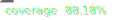

# The Map Game

 

## Requirements

- [Node.js v18](https://nodejs.org/en/)
- [Yarn 3](https://yarnpkg.com/en/docs/install)

## Development

- To install the dependencies, run the following command:

```bash
$ yarn install
```

- Compile TypeScript files with the following command:

```bash
$ yarn build
```

- Run the application with the following command:

```bash
$ yarn help # Display the available commands
$ yarn start # Start the application with default configuration
```

- Run tests with the following command:

```bash
$ yarn test # or
$ yarn test:ci # for continuous integration
```
