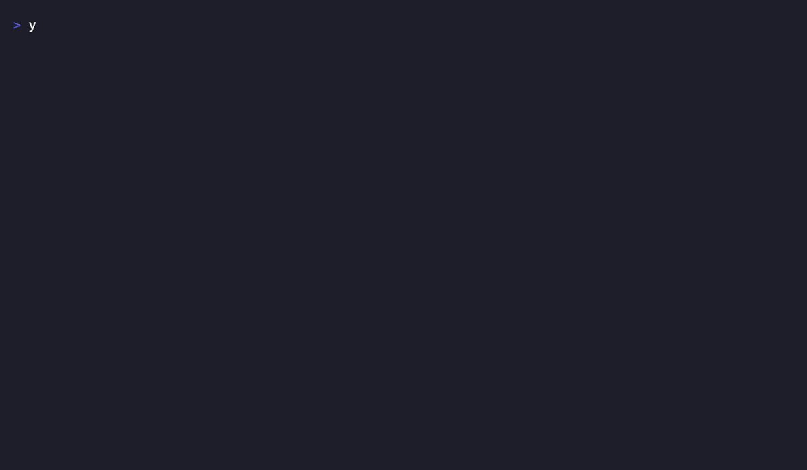

```
 ███╗   ███╗ █████╗ ██████╗      ██████╗  █████╗ ███╗   ███╗███████╗
 ████╗ ████║██╔══██╗██╔══██╗    ██╔════╝ ██╔══██╗████╗ ████║██╔════╝
 ██╔████╔██║███████║██████╔╝    ██║  ███╗███████║██╔████╔██║█████╗
 ██║╚██╔╝██║██╔══██║██╔═══╝     ██║   ██║██╔══██║██║╚██╔╝██║██╔══╝
 ██║ ╚═╝ ██║██║  ██║██║         ╚██████╔╝██║  ██║██║ ╚═╝ ██║███████╗
 ╚═╝     ╚═╝╚═╝  ╚═╝╚═╝          ╚═════╝ ╚═╝  ╚═╝╚═╝     ╚═╝╚══════╝
```

<p align="center">
  <strong>A turn-based territory grab, played in your terminal — claim regions, paint the map, take the board.</strong>
</p>

<p align="center">
  
  
  
  
  
  
</p>

**The Map Game** is a small, self-contained turn-based strategy game that runs entirely in the
terminal. A grid is partitioned into colored regions; players take turns claiming a region by
its number, and each claimed region is repainted in the owning player's color. It's a compact,
fully-typed TypeScript codebase — a clean little domain model (`Game`, `WorldMap`, `Region`,
`Tile`, `Player`) wrapped in a `chalk`-rendered board — built as a tidy, test-driven sandbox.

## ✨ Features

- **Terminal-native board** — the map renders as a bordered grid with each region drawn in a
  distinct background color via [`chalk`](https://github.com/chalk/chalk).
- **Turn-based capture** — players cycle in order; on your turn you type a region number and it
  is repainted in your color.
- **Two ways to build a world** — load a hand-authored region layout with `WorldMap.fromMap(...)`,
  or generate a blank `N×N` board with `WorldMap.fromRegions(size, regions)`.
- **Clean domain model** — small, single-responsibility classes (`Game`, `WorldMap`, `Region`,
  `Tile`, `Player`) with colocated unit tests.
- **Fully typed & linted** — strict TypeScript, ESLint + Prettier, and a Jest test suite with
  enforced coverage thresholds.

## 🎬 Demo

<p align="center">
  
</p>

<p align="center"><em>Three players take turns claiming regions — each capture repaints the region in the player's color.</em></p>

## 📦 Installation

Requires [Node.js 18](https://nodejs.org/en/) and [Yarn 3](https://yarnpkg.com/). The repo
pins its own Yarn release via [Corepack](https://nodejs.org/api/corepack.html), so no global
Yarn install is needed.

```bash
git clone https://github.com/cajias/map-game.git
cd map-game
yarn install
```

## 🚀 Usage

Start a game:

```bash
yarn start
```

The board prints with a `> Player N:` prompt. On each turn, type the **number of the region**
you want to claim and press <kbd>Enter</kbd>; the board clears and redraws with that region
painted in your color. Play cycles through the players for a fixed number of rounds.

```
╔═══════════╗
║00002222222║
║01111112242║
║01111112242║
║01122222242║
║01122222242║
║00000334443║
║00000334443║
║00000334443║
║00000333343║
║00000333333║
║00000333333║
╚═══════════╝
> Player 0:
```

Compile the TypeScript sources to `dist/`:

```bash
yarn build
```

## 🗂️ Project Structure

```
map-game/
├── src/
│   ├── index.ts              # Entry point — builds the world and runs the game loop
│   ├── cli/
│   │   ├── cli.ts            # yargs config parser (mapSize / regions options)
│   │   └── index.ts          # Barrel re-export for the cli module
│   └── model/
│       ├── Game.ts           # Turn loop, player rotation, stdin input handling
│       ├── Player.ts         # Player identity + assigned color
│       ├── Region.ts         # A group of tiles owned by a player
│       ├── index.ts          # Barrel re-export for the model
│       ├── model.puml        # PlantUML diagram of the domain model
│       └── WorldMap/
│           ├── WorldMap.ts   # Grid of tiles + regions; board rendering
│           └── Tile.ts       # A single cell — region id + color
├── package.json              # Scripts, deps, Jest & ESLint config
├── tsconfig.json             # TypeScript compiler options
└── .github/workflows/ci.yaml # Lint + test + coverage on pull requests
```

## 🛠️ Development

| Task                  | Command         |
| --------------------- | --------------- |
| Install dependencies  | `yarn install`  |
| Run the game          | `yarn start`    |
| Build (`tsc` → dist/) | `yarn build`    |
| Lint                  | `yarn lint`     |
| Test                  | `yarn test`     |
| Test (CI + coverage)  | `yarn test:ci`  |

Tests are written with [Jest](https://jestjs.io/) and [ts-jest](https://kulshekhar.github.io/ts-jest/)
and live alongside the code they cover (`*.test.ts`). The `test:ci` script enforces the coverage
thresholds declared in `package.json`.

## 🤝 Contributing

Contributions are welcome. Fork the repo, create a feature branch, make sure `yarn test` passes,
and open a pull request against `main`. Please keep the code formatted (`yarn lint`) before
submitting.

## 📄 License

Released under the [MIT License](LICENSE). Copyright © 2026 Raul Cajias.
